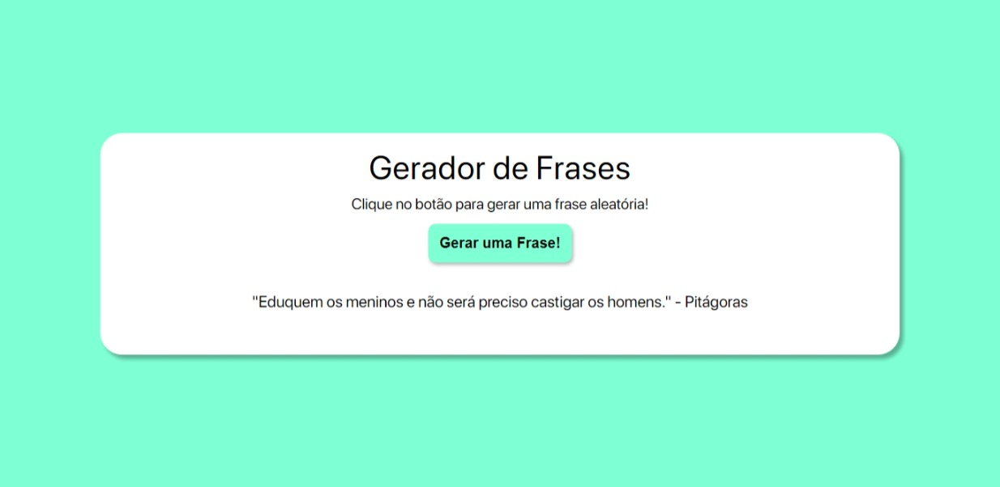

# Gerador Aleatório de Frases

Gerador de frases aleatórias simples, utilizando Javascript. Acesse a demonstração do projeto clicando neste link -> [DEMO](https://victordlmoraes.github.io/gerador-de-frases/)

## Menu

- [Descrição](#ancora1)
- [Screenshots](#ancora2)

## :pushpin: Descrição

As frases estão contidas em um array de nome _quotes_. A partir de uma função usando _Math_ e o tamanho do array, é feita uma escolha aleatória de um dos elementos desse array, contendo uma das frases, a cada clique no botão pelo usuário.

A frase então é exibida logo abaixo do botão para a visualização do usuário.

## :camera_flash: Screenshots

Desktop

Mobile

  

